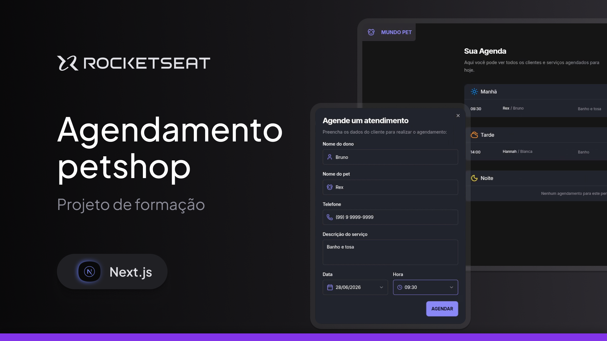
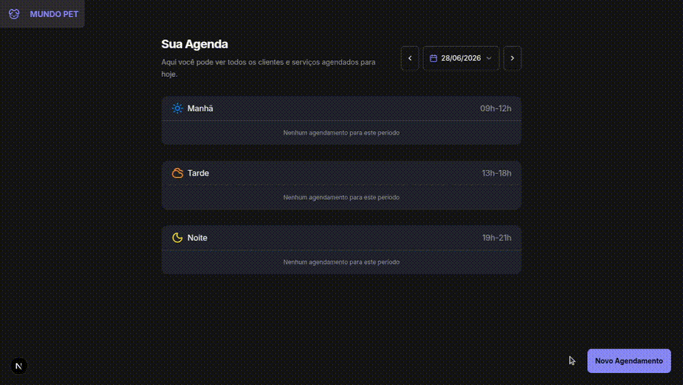

<h1 align="center">Mundo Pet</h1>

O projeto é um site web responsivo de agendamento de pet shop com a possibilidade de agendar clientes, editar e remover o agendamento.

 * [Next.js](https://nextjs.org/) 
 * [Prisma](https://www.prisma.io/orm)
 * [PostgreSQL](https://www.postgresql.org/) 
 * [TypeScript](https://www.typescriptlang.org/)
 * [Tailwind CSS](https://tailwindcss.com/) 

Tabela no banco de dados PostgreSQL

| appointments |
| ------------ | 
| id           | 
| ownerName    |
| petName      | 
| phone        |
| description  |
| scheduleAt   |
